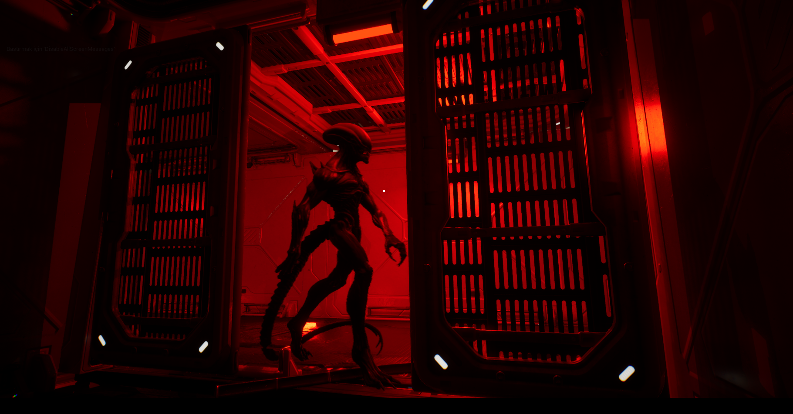

# SciFi-Horror-Demo
UE5 Sci-Fi Horror Demo: Showcasing dynamic AI sensory detection, environmental puzzles, and atmospheric tension.

# Sci-Fi Horror Survival Prototype (Inspired by Alien: Isolation)

**Role:** Core Developer & Scrum Master
**Engine:** Unreal Engine 5
**Language/Tools:** C++, Blueprints

## About The Project
This is a tension-filled survival horror prototype developed with a small team. The primary focus of this project was to engineer a complex enemy AI from scratch and build an atmospheric core gameplay loop.

## Core Features & Technical Showcase

### 1. Dynamic Enemy AI (Sensory Detection)

> **Under the hood:** Engineered the enemy behavior logic. The AI doesn't just follow a path; it dynamically reacts to the player's sight and sound, creating genuine tension.

### 2. Environmental Puzzles & Door Progression

> **The Mechanic:** Designed interactive systems where players must solve environmental puzzles under pressure to unlock the progression paths.

### 3. Atmospheric Level Design

> **Visuals:** A look at the linear demo map where we successfully tested the core mechanics and lighting to maximize player immersion.
